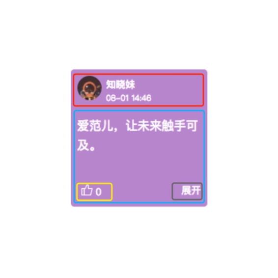

# brick-layout 使用指南
### 介绍
  brickLayout 为使用者提供开箱即用的瀑布流布局的一种可行性的方案，使用者仅需要按照对应所需的字段传入瀑布流组件，即可快速实现瀑布流布局。未来的瀑布流组件将会提供更多样式、适用更多场景的瀑布流模板，敬请期待！

  

### 使用
1. 在微信小程序管理后台中，按 APPID `wx3c042630f3cdc175` 搜索到该插件，点击添加，即可在代码中使用 `brickLayout`。

2. 在 `app.json` 里，声明该插件的引入，目前该插件为`0.1.0`，`provider`为该插件的 APPID，`brickLayout`为自定义的插件名称。
```json
"plugins": {
  "brickLayout": {
    "version": "0.1.0",
    "provider": "wx3c042630f3cdc175"
  }
}
```

3. 在需要引用瀑布流组件的小程序页面的`json`配置文件中，作如下配置：
```json
{
  "usingComponents": {
    "brickLayout": "plugin://brickLayout/brickLayout"
  }
}
```

4. 使用方法
```html
<brickLayout 
  dataSet="{{dataSet}}"  
  option="{{brick_option}}" 
  bind:tapCard="tapCard" 
  bind:tapLike="handleLike" 
  bind:tapUser="handleUserEvent"
  bind:onCardExpanded="handleExpand"
/>
```

### 组件属性介绍
* **dataSet**
	* **类型：**  `Array<Object>`
	* **类别：** required 必填参数
	* **示例值说明：**
		* **id**  
			* 类型： `string`
			* 说明：数据每条记录的唯一标志
		* **content**  
			* 类型：`string`
			* 说明：卡片实际记录的内容，暂不支持解析富文本。
		* **backgroundColor** 
			* 类型：`string`
			* 说明：(optional) 每个卡片的背景颜色 如果不填 则为随机色
		* **time** 
			* 类型：`unix timestamp`
			* 说明：(optional) 记录的时间戳 如果不填默认没有时间显示
		* **likedCount** 
			* 类型：`number`
			* 说明：(optional) 右下角点赞的数量 如果不填默认没有卡片右下角显示
		* **liked** 
			* 类型：`bool`
			* 说明：(optional) 如果需要点赞功能，则需要该变量作为用户是否已经点赞的标志，如果为 false 则代表未点赞，icon 为空心 icon，且可以触发点赞动作；如果为 true 则代表已点赞，icon 为实心 icon，且不可再触发点赞动作。
		* **user** 
			* 类型：`Object`
			* 说明：(optional) 如果不传，则不显示卡片用户区
				* 类型：`string`  (optional param) `avatar` 用户头像 url 如果不填默认没有头像
				* 类型：`string`  (optional param) `username` 用户名 如果不填默认没有用户名
				* 类型：`string`  (optional param) `userId` 用户 id， 如果需要点击用户区域相关事件，可以传入 `userId` ,用于相关点击用户区域事件回调
	* **示例值：**

```js
 [{
   id: '1' ,
   content: 'Lorem ipsum dolor sit amet, consectetur adipisicing elit, sed do eiusmod tempor incididunt ut labore et dolore magna aliqua. ',
   backgroundColor: '#fff',
   time: 1533106010,
   likedCount: 0 ,
   liked: false,
   user :  {
     avatar: 'user_avatar_url',
     name: 'Minya Chan',
     userId: '1'
   }
 },
 {
   id: '2' ,
   content: 'Lorem ipsum dolor sit amet, consectetur adipisicing elit, sed do eiusmod tempor incididunt ut labore et dolore magna aliqua. ',
   backgroundColor: '#fff',
   time: 1533106010,
   likedCount: 0 ,
   liked: false,
   user :  {
     avatar: 'user_avatar_url',
     name: 'Minya Chan',
     userId: '1'
   }
 }]
```
---
* **option**
	* **类型：** `Object`
	* **类别：** optional 选填参数
	* **示例值说明：**
	    * **defaultExpandStatus**
		    * 类型： `bool`
		    * 说明： (optional) 卡片默认展开情况，默认值为 `false` ，即为默认收起
	    * **backgroundColor**
		    * 类型：`string`
		    * 说明： (optional) 每个卡片默认统一的颜色，如果已经设置了卡片的颜色，优先使用卡片颜色；如果既没有卡片颜色，也没有设置全局背景色，则默认为随机色。即优先级：`card.backgroundColor` > `backgoundColor` > `randomColor`
	    * **forceRepaint**
		    * 类型： `bool`
		    * 说明： (optional) 是否强制重绘，强制重绘则会使原来的展开状态、高度等等全部重置，数据重新渲染。默认值为 `false`，即默认认为源数据的改变只是追加、变更或者减少数据时，不重置卡片的展开状态和高度等等。
	*  **示例值：**
```js
{
  defaultExpandStatus: false,
  ackgroundColor:  '#ababab',
  forceRepaint: false
}
```
---
### 组件事件介绍
如调用的组件的 wxml 声明如下：
```html
<brickLayout 
  dataSet="{{dataSet}}"  
  option="{{brick_option}}" 
  bind:tapCard="tapCard" 
  bind:tapLike="handleLike" 
  bind:tapUser="handleUserEvent"
  bind:onCardExpanded="handleExpand"
/>
```

* **用户点击区域说明**



* **tapCard**
	* **类型：** `function`
	* **类别：** optional 选填参数
	* **说明：** 当用户点击卡片区域时，所触发的自定义事件，可以通过 `event.detail.card_id`拿到对应的卡片的 id，该卡片 id 为 dataSet 里面的唯一标志，唯一标志该数据记录。
	* **示例：**
```js
tapCard: function (event) {
  const cardId =  event.detail.card_id
  // code here.
  console.log('tap card!')
},
```

---
* **tapLike**
	* **类型：** `function`
	* **类别：** optional 选填参数
	* **说明：** 当用户点击点赞区域时，所触发的自定义事件，可以通过 `event.detail.card_id`拿到对应的卡片的 id，该卡片 id 为 dataSet 里面的唯一标志，唯一标志该数据记录。
	* **示例：**
```js
handleLike: function (event) {
  const cardId =  event.detail.card_id
  // code here.
  console.log('tap like!')
},
```

---
* **tapUser**
	* **类型：** `function`
	* **类别：** optional 选填参数
	* **说明：** 当用户点击用户区域（包括 头像、用户名、时间等顶部区域）时，所触发的自定义事件，前提是要传入 `userId`，使用过程中，可以通过 `event.detail.user_id` 拿到所对应的用户 userId
	* **示例：**
```js
handleUserEvent: function (event) {
  const userId =  event.detail.user_id
  // code here.
  console.log('tap user!')
},
```

---
* **onCardExpanded**
	* **类型：** `function`
	* **类别：** optional 选填参数
	* **说明：** 当用户触发展开卡片按钮时，所触发的展开之后的自定义事件，前提是要默认缩起的状态才会有展开和缩起的事件回调，可以通过 `event.detail.card_id` 拿到所对应触发的卡片 id ,该卡片 id 为 dataSet 里面的唯一标志，唯一标志该数据记录；同时还可以通过 `event.detail.expand_status` 拿到当前卡片的展开状态，`true` 代表目前为 `展开` 状态。
	* **示例：**
```js
handleExpand:function(event){
  const cardId =  event.detail.card_id
  const expandStatus =  event.detail.expand_status
  // code here
  console.log("expand call back")
},
```
